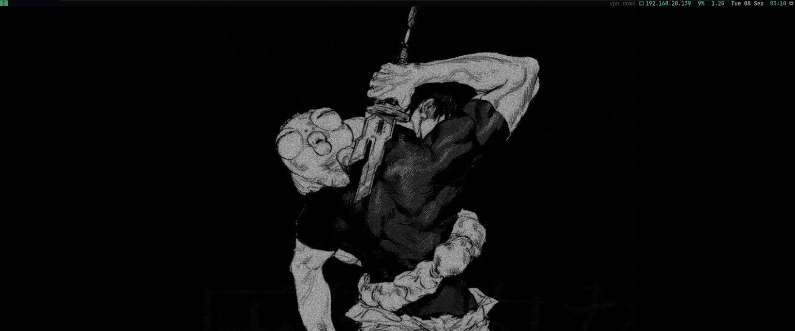
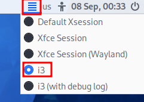

<div align="center">

<h1>Kali Workstation</h1>

<p><strong>A focused environment for pentesting, labs, and OSCP preparation.</strong></p>

<p>Tiling windows · Persistent sessions · Target awareness · Nightgrid theme</p>

<p>
  
  
  
  
</p>

<p>
  <a href="#quick-start">Installation</a> ·
  <a href="#daily-workflow">Workflow</a> ·
  <a href="#session-manager">Session manager</a> ·
  <a href="#keyboard-shortcuts">Shortcuts</a> ·
  <a href="https://github.com/MarcussanMG/kali-dotfiles/releases">Releases</a>
</p>



<p><sub>The desktop, tools, and custom helpers in action.</sub></p>

</div>

## Overview

My personal Kali Linux dotfiles, built around the way I work through pentesting labs: terminals, enumeration, browser testing, notes, and persistent sessions.

The **nightgrid** theme brings i3, Kitty, tmux, Rofi, and Zsh together with a consistent dark palette and green accents. Custom scripts handle the small tasks that come up throughout a session.

| Feature | What it does |
|---|---|
| **Custom session manager** | Find, restore, or delete tmux sessions through a Rofi picker. |
| **Target tracking** | Display the selected target in the prompt, tmux status line, and desktop bar. |
| **Network context** | Keep the VPN address and network information close to your commands. |
| **Engagement helpers** | Create working folders, extract Nmap ports, and open reference notes. |
| **BloodHound helpers** | Start and stop the stack, retrieve the initial password, or explicitly reset its data. |
| **Browser setup** | Configure Firefox extensions and import Burp's CA certificate. |
| **Desktop utilities** | Take screenshots, use a wallpaper-based lock screen, and toggle compositing. |
| **Organized toolkit** | Arrange tools under `~/tools/` by purpose and attack phase. |

## Quick start

Designed for **Kali Linux on x86_64**, using an **X11 desktop session**. Installation requires Internet access and a regular user with `sudo` privileges.

```bash
git clone https://github.com/MarcussanMG/kali-dotfiles.git ~/.dotfiles
cd ~/.dotfiles
./bootstrap.sh
```

Log out, choose **i3** at the login screen, and log back in.

<details>
<summary><strong>Where to select the i3 session</strong></summary>

<p align="center">
  
</p>

</details>

Keep the repository at `~/.dotfiles`: several configuration paths refer to that location.

### Already have the dependencies?

Apply the configuration links directly:

```bash
cd ~/.dotfiles
./install.sh
```

| Script | Purpose |
|---|---|
| `bootstrap.sh` | Install dependencies, prepare the toolkit, and run the configuration installer. |
| `install.sh` | Link configuration files and helper scripts into place. |

The installer creates missing destination directories and backs up replaced regular configuration files. Existing symlinks may be replaced. An existing Firefox policy is backed up when its contents differ.

## Daily workflow

### Start an engagement

```bash
mkt example-box             # create folders and enter the engagement directory
target 10.10.11.42          # set the target and export $T in this shell
```

`mkt` creates `nmap/`, `web/`, `loot/`, `exploits/`, and a starter `notes.md` inside `~/engagements/example-box/`.

```bash
echo "$T"                  # selected target
echo "$V"                  # tun0 IPv4 address
echo "$E"                  # detected network interface IPv4 address

extractports nmap/scan.gnmap # extract open ports and copy them to the clipboard
```

`$V` and `$E` refresh before the prompt, at most once every ten seconds. `$T` is set in the shell where you run `target` and loaded when new shells start; other open shells keep their existing value.

### Useful commands

| Command | Action |
|---|---|
| `target` | Print the selected target. |
| `cleartarget` | Clear the saved target and unset `$T` in this shell. |
| `tun` | Show the `tun0` IPv4 address. |
| `myip` | Show IPv4 interface information. |
| `ports` | List listening TCP and UDP sockets. |
| `serve` | Serve the current directory over HTTP on port 80. |
| `notes` | Open the synced CherryTree reference notes. |
| `tools` | Jump to `~/tools` (the arsenal). |
| `ll` | Detailed directory listing with icons and Git information. |
| `tree` | Display the directory tree with icons. |

## Session manager

**Close a terminal window and return to its running tmux session later.**

Each new Kitty window starts an independent tmux server. The custom Rofi picker lists sessions across these servers, including sessions left running after a window closes.

Open the picker:

```bash
~/.local/bin/tmux-attach-picker
```

| Picker shortcut | Action |
|---|---|
| `Enter` | Open the selected session in Kitty. |
| `Ctrl + X` | Kill the selected session. |
| `Ctrl + Alt + X` | Kill all sessions across the managed Kitty servers, after confirmation. |

Sessions remain available while their tmux server is running. They **do not survive a reboot**. The bulk cleanup also affects sessions attached to open windows.

<details>
<summary><strong>Open the picker with Super + Shift + Enter</strong></summary>

Add this binding to `~/.config/i3/config` if it is not already present:

```i3config
bindsym $mod+Shift+Return exec --no-startup-id ~/.local/bin/tmux-attach-picker
```

Reload i3 with `Super + Shift + C`.

</details>

## Keyboard shortcuts

**`Super` is the Windows key. The tmux prefix is `Ctrl + A`.**

### Essentials

| Shortcut | Action |
|---|---|
| `Super + Enter` | Open Kitty with a fresh tmux session. |
| `Super + D` | Open the application launcher. |
| `Super + Shift + F` | Open Firefox. |
| `Super + Shift + B` | Open Burp Suite. |
| `Super + Shift + T` | Set the target through Rofi. |
| `Super + Shift + S` | Capture a screen region to `~/screenshots` and the clipboard. |
| `Super + Shift + P` | Toggle desktop effects. |
| `Super + Shift + L` | Lock the screen. |
| `Super + Shift + X` | Open the power menu. |

<details>
<summary><strong>Window management</strong></summary>

| Shortcut | Action |
|---|---|
| `Super + arrows` | Focus a window. |
| `Super + Shift + arrows` | Move a window. |
| `Super + 1–9` | Switch workspace. |
| `Super + 0` | Switch to workspace 10. |
| `Super + Shift + 1–9` | Move a window to a workspace. |
| `Super + Shift + 0` | Move a window to workspace 10. |
| `Super + H` / `Super + V` | Choose horizontal or vertical splitting. |
| `Super + F` | Toggle fullscreen. |
| `Super + Shift + Space` | Toggle floating mode. |
| `Super + Space` | Switch focus between tiling and floating windows. |
| `Super + A` | Focus the parent container. |
| `Super + S` / `Super + W` | Use stacking or tabbed layout. |
| `Super + E` | Toggle split layout. |
| `Super + R` | Enter resize mode; press `Escape` to leave. |
| `Super + Shift + Q` | Close the focused window. |
| `Super + Shift + C` | Reload the i3 configuration. |
| `Super + Shift + R` | Restart i3. |
| `Super + Shift + E` | Open the confirmation prompt to exit i3. |

</details>

<details>
<summary><strong>tmux sessions, panes, and windows</strong></summary>

Press `Ctrl + A`, release it, then press the listed key. **Uppercase and lowercase keys perform different actions.**

| Key | Action |
|---|---|
| `/` | Split left/right. |
| `-` | Split top/bottom. |
| `arrows` | Focus a pane. |
| `t` | Rename a pane. |
| `m` | Swap with a specific pane number. |
| `{` / `}` | Swap with the previous or next pane. |
| `c` | Create a window. |
| `,` | Rename the current window. |
| `w` | Choose a session or window on the current tmux server. |
| `n` | Create a named session. |
| `N` | Rename the current session. |
| `d` | Detach from the session. |
| `S` | Toggle the status line. |
| `r` | Reload the tmux configuration. |
| `q` | Kill the current session after confirmation. |

Mouse support is enabled. In tmux copy mode, `Space` starts a selection and `Enter` copies it to the system clipboard.

</details>

<details>
<summary><strong>Clipboard and shell</strong></summary>

| Shortcut | Action |
|---|---|
| `Ctrl + Shift + C` / `V` | Copy or paste through the system clipboard. |
| `Ctrl + Alt + Shift + C` / `V` | Copy or paste through Kitty's private buffer 2. |
| `Ctrl + Alt + Shift + X` / `P` | Copy or paste through Kitty's private buffer 3. |
| `Ctrl + R` | Search shell history with fzf. |
| `Right arrow` | Accept a Zsh autosuggestion when the cursor is at the end of the command. |
| `Ctrl + P` | Toggle between one-line and two-line prompts. |
| `Ctrl + U` | Delete to the start of the command line. |
| `Shift + Tab` | Undo the last edit. |

</details>

## Tools and integrations

### BloodHound CE

Manage the Docker Compose stack directly from the shell:

```bash
bloodhound up       # start the stack and look for the initial password
bloodhound down     # stop the stack while preserving its data
bloodhound creds    # search the logs for the initial password
```

Open [BloodHound](http://localhost:8080/ui/login) and sign in as `admin`.

The initial password is generated during the first account setup. If you have already changed it, use your chosen password; the log entry does not reflect later password changes.

<details>
<summary><strong>Resetting BloodHound</strong></summary>

```bash
bloodhound reset
```

This removes the stack's database volumes and starts it again with fresh data. You must type `YES` to confirm.

**All imported BloodHound data is deleted.** Use this when you deliberately want a clean instance.

</details>

Burp's proxy and BloodHound both default to port `8080`. Run them separately or change one of their configured ports.

### Burp Suite and Firefox

Launch Firefox once to create its profile, then run:

```bash
~/.dotfiles/bin/setup-burp.sh
```

The helper starts Burp if needed, waits for its local proxy, imports its CA certificate into Firefox, and copies a FoxyProxy import string to the clipboard. Complete Burp's project setup when prompted.

Paste the string into **FoxyProxy → Options → Import Proxy List**.

Firefox policies configure **FoxyProxy** and **Wappalyzer**. Certificate import requires `libnss3-tools`, included in the bootstrap package list.

### Reference notes

```bash
notes
```

Opens the CherryTree notes synced from [PentestingNotes](https://github.com/MarcussanMG/PentestingNotes).

At i3 session startup, the sync script refreshes `~/.notes-repo` from GitHub and discards local edits and untracked files in that clone. Treat it as a reference copy; maintain the original notes separately and keep engagement notes under `~/engagements/`.

### Toolkit organization

`bootstrap.sh` prepares tools under `~/tools/`.

| Area | Examples |
|---|---|
| Reconnaissance | Kerbrute, AutoRecon |
| Linux privilege escalation | linPEAS, Linux Smart Enumeration, Linux Exploit Suggester, LinEnum, pspy |
| Windows privilege escalation | WinPEAS, PowerUp, PrivescCheck, AccessChk, Seatbelt, wesng, PrintSpoofer, GodPotato, RoguePotato |
| Active Directory | Impacket helpers, BloodHound collectors, PowerView, Certipy |
| Shells and payloads | Ncat, Plink, web shells, Penelope |
| Tunneling and pivoting | Ligolo-ng, Chisel, Socat |
| Exploit utilities | git-dumper, AutoBlue |

Some tools come from Kali packages; others are downloaded from upstream projects. Check the bootstrap output for unavailable packages or failed downloads. See [bootstrap.sh](bootstrap.sh) for the complete list and download sources.

## Make it yours

| Configuration | Controls |
|---|---|
| [i3/config](i3/config) | Workspaces, keybindings, layouts, startup applications |
| [kitty/kitty.conf](kitty/kitty.conf) | Font, spacing, clipboard bindings, terminal behavior |
| [kitty/nightgrid.conf](kitty/nightgrid.conf) | Terminal colors |
| [tmux/tmux.conf](tmux/tmux.conf) | Panes, windows, status line, tmux bindings |
| [zsh/.zshrc](zsh/.zshrc) | Prompt, aliases, shell helpers |
| [rofi/theme.rasi](rofi/theme.rasi) | Launcher appearance |
| [picom/picom.conf](picom/picom.conf) | Compositing and visual effects |
| [i3blocks/config](i3blocks/config) | Desktop status bar |
| [bin/](bin/) | Custom workstation scripts |

<details>
<summary><strong>Change the wallpaper</strong></summary>

Replace the wallpaper with a PNG:

```bash
cp /path/to/wallpaper.png ~/.dotfiles/wallpapers/nightgrid.png
feh --bg-fill ~/.dotfiles/wallpapers/nightgrid.png
rm -f ~/.cache/i3lock/blurred.png
```

The desktop and lock screen use this image. Removing the cached lock-screen image lets it be regenerated.

</details>

<details>
<summary><strong>Compositing in VMware</strong></summary>

Picom uses the `xrender` backend.

If you experience graphical stuttering, use `Super + Shift + P` to toggle effects. The compositor-off preference is retained across restarts.

</details>

<details>
<summary><strong>Validate configuration changes</strong></summary>

```bash
i3 -C -c ~/.config/i3/config
zsh -n ~/.zshrc

bash -n ~/.dotfiles/install.sh
bash -n ~/.dotfiles/bootstrap.sh

for script in ~/.dotfiles/bin/* ~/.dotfiles/i3blocks/scripts/* ~/.dotfiles/tmux/scripts/*; do
    bash -n "$script"
done
```

These checks validate configuration or shell syntax. Verify desktop behavior and installation separately on your Kali setup.

</details>

---

<div align="center">

<p><strong>Built by <a href="https://github.com/MarcussanMG">Marc Martin Gil</a></strong></p>

<p>
  <a href="https://marcmartingil.com/">Portfolio</a> ·
  <a href="https://github.com/MarcussanMG/PentestingNotes">Pentesting notes</a> ·
  <a href="https://github.com/MarcussanMG/kali-dotfiles/issues">Report an issue</a> ·
  <a href="LICENSE">License</a>
</p>

</div>
