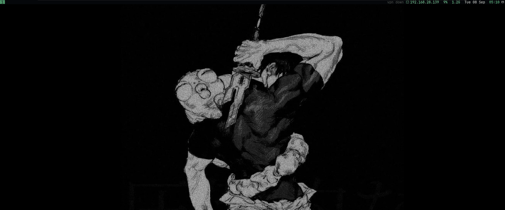
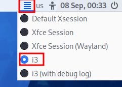

<div align="center">

# kali-dotfiles

**A reproducible Kali Linux workstation for OSCP / PEN-200, built around i3.**

i3 · Kitty · tmux · Zsh · Rofi · Picom — one `nightgrid` theme, one `./bootstrap.sh`.



</div>

---

## Requirements

- **Kali Linux**, x86_64, **X11** session
- A regular user with **sudo**
- Internet access

## Install

```bash
git clone https://github.com/MarcussanMG/kali-dotfiles.git ~/.dotfiles
cd ~/.dotfiles
./bootstrap.sh
```

`bootstrap.sh` asks how to install:

- **Full** — core desktop/shell **+** every optional component.
- **Custom** — a checklist (**↑/↓** move, **Space** toggle, **Enter** confirm) to pick which optional components to install: pentest arsenal, SecLists, notes sync, Postman, and the [Neovim config](https://github.com/MarcussanMG/nightgrid.nvim).

The **core** (i3, Kitty, tmux, Zsh, Rofi, Picom, fonts, VM tools) is always installed. A non-interactive run (piped, or no `whiptail`) installs everything. The script is safe to re-run.

When it finishes: **log out → pick the i3 session → log back in.** Set Zsh as your login shell if needed:

```bash
chsh -s "$(command -v zsh)"
```

<details>
<summary><strong>Where to select the i3 session</strong></summary>

<p align="center">
  
</p>

</details>

## Burp Suite & Firefox

Launch Firefox once to create its profile, then run:

```bash
~/.dotfiles/bin/setup-burp.sh
```

The helper starts Burp if needed, waits for its proxy, imports Burp's CA certificate into Firefox, and copies a FoxyProxy import string to the clipboard — paste it into **FoxyProxy → Options → Import Proxy List**. Complete Burp's project setup when prompted.

Firefox policies preinstall **FoxyProxy**, **Wappalyzer**, **Dark Reader** and **HackTools**, and force the interface and search language to English. Certificate import needs `libnss3-tools` (part of the core package list).

## Neovim

The optional **Neovim config** is [nightgrid.nvim](https://github.com/MarcussanMG/nightgrid.nvim) — a black/green Lua setup (lazy.nvim, LSP, Telescope, dashboard, which-key). When selected in the installer, `bootstrap.sh` clones it to `~/.local/share/nightgrid.nvim` and runs its own installer, which installs a compatible Neovim if Kali's is too old and copies the config into `~/.config/nvim`.

## Keyboard shortcuts

`Super` = Windows key (Mod4). `Alt` = Mod1.

### Windows & layout
| Key | Action |
|---|---|
| `Super + Enter` | New Kitty terminal (fresh tmux session) |
| `Alt + Tab` | Jump to the previous window; tap again to toggle back |
| `Super + ←/↓/↑/→` | Move focus |
| `Super + Shift + ←/↓/↑/→` | Move the window |
| `Super + h` / `Super + v` | Split horizontal / vertical |
| `Super + s` / `Super + w` / `Super + e` | Stacking / tabbed / toggle split |
| `Super + f` | Fullscreen |
| `Super + Shift + Space` | Float the focused window |
| `Super + t` | Float/tile the **whole** workspace (classic stacking feel) |
| `Super + Space` | Focus between tiling and floating |
| `Super + Shift + q` | Close window |
| `Super + r` | Resize mode (`Super + Ctrl + Shift + arrows` to resize) |

### Workspaces & session
| Key | Action |
|---|---|
| `Super + 1…0` | Switch to workspace 1–10 |
| `Super + Shift + 1…0` | Move window to workspace 1–10 |
| `Super + Shift + c` / `r` / `e` | Reload / restart / exit i3 |

### Launchers & tools
| Key | Action |
|---|---|
| `Super + d` | Application launcher (Rofi) |
| `Super + Shift + Enter` | tmux session picker (restore/kill) |
| `Super + Shift + f` / `b` | Firefox / Burp Suite |
| `Super + Shift + t` | Set the engagement target (Rofi) |
| `Super + Shift + s` | Screenshot |
| `Super + Shift + x` | Power menu |
| `Super + Shift + l` | Lock screen |
| `Super + Shift + p` | Toggle Picom effects |

### tmux — prefix `Ctrl + a`
| Key | Action |
|---|---|
| `Ctrl+a` `/` | Split pane side by side |
| `Ctrl+a` `-` | Split pane stacked |
| `Ctrl+a` `←/↓/↑/→` | Move between panes |
| `Ctrl+a` `m` | Swap with another pane (by number) |
| `Ctrl+a` `t` | Set pane title |
| `Ctrl+a` `n` / `N` | New named session / rename session |
| `Ctrl+a` `q` | Kill the session (asks first) |
| `Ctrl+a` `S` | Toggle the status bar |
| `Ctrl+a` `r` | Reload tmux config |
| `Ctrl+a` `[` | Copy mode — `Space` starts selection, `Enter` copies to the system clipboard |
| `Ctrl+a` `d` | Detach (reattach from `Super + Shift + Enter`) |

Mouse support is on: click to select panes, drag borders to resize, scroll to enter copy mode.

## Shell helpers

| Command | Action |
|---|---|
| `target [IP]` | Set (or print) the engagement target. Shown in every prompt and exported as `$T`, shared across all tabs. |
| `cleartarget` | Clear the target. |
| `mkt <box>` | Scaffold `~/engagements/<box>/` (`enumeration/nmap/ web/ loot/ exploits/ privesc/{windows,linux}/ notes.md`) and stage kerbrute + nxcspray into `enumeration/`. Re-run to migrate an old layout or re-enter the folder. |
| `extractports <scan.gnmap>` | Extract open ports from an Nmap scan and copy them to the clipboard. |
| `clearcache [-y]` | Wipe regenerable tool output & caches (penelope/nxc/msf dumps, pip/thumbnail/browser caches, Trash). Keeps loot, creds, the nxc workspace and your target; add paths with `NG_CACHE_EXTRA`. |
| `tools` | `cd ~/tools`. |
| `notes` | Open the synced CherryTree reference notes. |
| `bloodhound up\|down\|creds\|reset` | Manage the BloodHound CE stack. |
| `tun` / `myip` / `ports` / `serve` | tun0 IP / interface IPs / listening sockets / HTTP server on `:80`. |

Shell variables refreshed each prompt: **`$T`** target · **`$V`** tun0 IP · **`$E`** interface IP.

## Completion

Tab-completion runs through **fzf-tab**: press `Tab` and matches open in a searchable fzf picker (nightgrid colours — type to filter, arrows to move, `Enter` to accept; `/` keeps drilling into paths).

For any command that ships no completion of its own — most pentest tools (ffuf, gobuster, netexec, …) and nmap, whose bundled completion is outdated — the flags are read **live from the tool's own `--help`** (falling back to `-h`, `-help`, a `help` subcommand, then its `man` page) and offered with their descriptions. Sub-commands work too, e.g. `gobuster dir --`⇥. Nothing is hardcoded; each command's options are cached for the session.

> The first `Tab` on a new command runs its help once (≤3 s); after that it's instant.

## Session manager

Each Kitty window gets its **own isolated tmux server** (keyed to the shell PID), so sessions never collide between windows or workspaces. `Super + Shift + Enter` opens a Rofi picker to re-attach or kill orphaned sessions whose terminal you closed.

> tmux sessions do **not** survive a reboot — the picker only recovers sessions from the current boot.

## Tools arsenal

`bootstrap.sh` builds `~/tools/`, organized by attack phase:

| Area | Tools |
|---|---|
| Reconnaissance | Kerbrute, AutoRecon |
| Linux privesc | linPEAS, LSE, Linux Exploit Suggester, LinEnum, pspy |
| Windows privesc | WinPEAS, PowerUp, PrivescCheck, AccessChk, Seatbelt, wesng, PrintSpoofer, GodPotato, JuicyPotato, RoguePotato |
| Active Directory | Impacket, BloodHound CE + collectors, PowerView, Certipy, netexec, PsExec64 |
| Shells & payloads | Ncat, Plink, web shells, Penelope |
| Tunneling & pivoting | Ligolo-ng, Chisel, Socat, proxychains |
| Exploits | git-dumper, Evil-Macro, AutoBlue-MS17-010 |

Some come from Kali packages, others from upstream releases. Check the bootstrap output for anything marked `UNAVAILABLE`. See [bootstrap.sh](bootstrap.sh) for the full list and sources.

## Customization

**Per-machine overrides** — copy the example and edit, without touching tracked files:

```bash
mkdir -p ~/.config/ng
cp ~/.dotfiles/zsh/local.conf.example ~/.config/ng/local.conf
```

| Variable | Default | Purpose |
|---|---|---|
| `NG_VPN_IF` | `tun0` | VPN interface used for `$V` and the prompt |
| `NG_HASHCAT_OPTS` | `-D 1` | Flags forced into the `hashcat` wrapper (CPU-only for a GPU-less VM; set empty on a real GPU) |

**Config files:**

| File | Controls |
|---|---|
| [i3/config](i3/config) | Workspaces, keybindings, layouts, startup |
| [kitty/kitty.conf](kitty/kitty.conf) · [kitty/nightgrid.conf](kitty/nightgrid.conf) | Terminal behavior / colors |
| [tmux/tmux.conf](tmux/tmux.conf) | Panes, windows, status line |
| [zsh/.zshrc](zsh/.zshrc) | Prompt, aliases, helpers |
| [rofi/theme.rasi](rofi/theme.rasi) | Launcher appearance |
| [picom/picom.conf](picom/picom.conf) | Compositing (tuned light for VMs) |
| [i3blocks/config](i3blocks/config) | Status bar |
| [bin/](bin/) | Workstation scripts |

**Wallpaper:** replace `wallpapers/nightgrid.png`, then `feh --bg-fill ~/.dotfiles/wallpapers/nightgrid.png` and `rm -f ~/.cache/i3lock/blurred.png`.

## Security

This repo is config only. It never contains, and `.gitignore` plus deliberate design keep out: SSH keys, VPN configs, passwords or tokens, the Burp CA and project data (`burp/`), shell history, exam/target data, and the actual CherryTree **notes content** (only the theme `config.cfg` is tracked). Notes live in a separate private repo synced to `~/.notes-repo`.

## Verify

```bash
i3 -C -c ~/.config/i3/config
zsh -n ~/.zshrc

bash -n ~/.dotfiles/install.sh
bash -n ~/.dotfiles/bootstrap.sh
for s in ~/.dotfiles/bin/* ~/.dotfiles/i3blocks/scripts/* ~/.dotfiles/tmux/scripts/*; do
    [[ -f "$s" ]] || continue
    head -1 "$s" | grep -qE 'bash|/sh|env sh' && bash -n "$s"
done
```

These validate configuration and shell syntax. Verify desktop behavior and a full install on a clean Kali separately.
